## Node CRUD apps

A simple rest api used to CRUD operation with user authentication.

### How to run the apps :

#### 1. Clone the repository
```
$ https://github.com/SutantoAdiNugroho/node-crud-docker.git
```

#### 2. Install dependencies
```
$ cd node-crud-docker
```
and then
```
$ npm install
```

#### 3. Configure .env file on the project
There is already a sample env file, and all the keywords from the env file must be filled in.

| Keywords        | Description                      |
| ----------------|----------------------------------|
| HOST_DB         | MongoDB host connection          |
| PORT            | Port to run the apps             |
| JWT_SECRET_KEY  | Key for build and sync JWT token |

#### 4. Launch the apps
Example command for running it locally :
```
$ npm run dev
```

Example running it by kubernetes cluster :

* Dockerizing the project
    ```
    $ docker build -t node-crud .
    ```
    After build process done, then we can check it by execute the container
    ```
    $ docker run -p 8080:8080 node-crud
    ```
* Upload the image to docker hub
    ```
    $ docker tag node-crud {username}/{repository}
    ```
    Then push it into repository
    ```
    $ docker push {username}/{repository}
    ```
* Start kubernetes cluster
    ```
    $ minikube start
    ```
    Then back to project folder for creating deployment into kubernetes cluster
    ```
    $ kubectl create -f deploy.yaml
    ```
* Expose deployment
    ```
    $ kubectl expose deployment {name_deployment} --type "LoadBalancer"
    ```
    We can see, the service has been created
    ```
    $ kubectl get svc
    ```

After the apps running is succesfully, we can start by calling routes. For example :
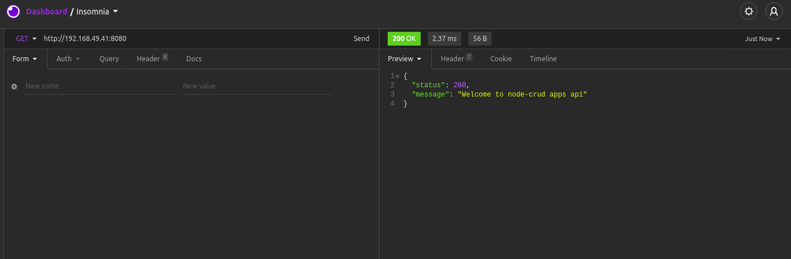

### API Guide And Documentation :

#### /api/auth

| Path            | Method | Description   |
| :---            | :---:  | :---          |
| /users/login    | POST   | User login    |

#### /api/profile

| Path              | Method | Description                            |
| :---              | :---:  | :---                                   |
| /test/admin       | POST   | Create first user account with role 'admin', so we can use this user for executing all CRUD operation |
| /users            | GET    | Show all user that has been registered |
| /user/:id         | GET    | Show one specific user by id           |
| /add/user/        | POST   | Create user                            |
| /modify/user/:id  | PUT    | Edit one specific user                 |
| /delete/user/:id  | DELETE | Delete one specific user               |


#### 1. Authentication

* ##### User Login

    * Access URL : /api/auth/users/register 
    * Method     : POST
    * Parameters :
    
        | Name     | Type     | Description       |
        | ---      | -----    | ----              |
        | email    | string   | Email of user |
        | password | string   | Password of user|
        
    * Example success response :
    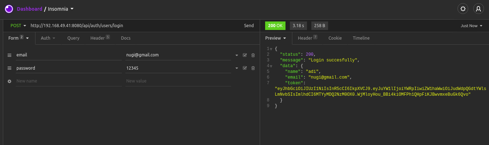

#### 2. CRUD Operation

* ##### Create first account with role 'admin'

    * Access URL : /api/profile/test/admin
    * Method     : POST
    * Additional : All of these user credential test is executing from .env file, so we have to put the test account credential into .env files
    * Example success response :
    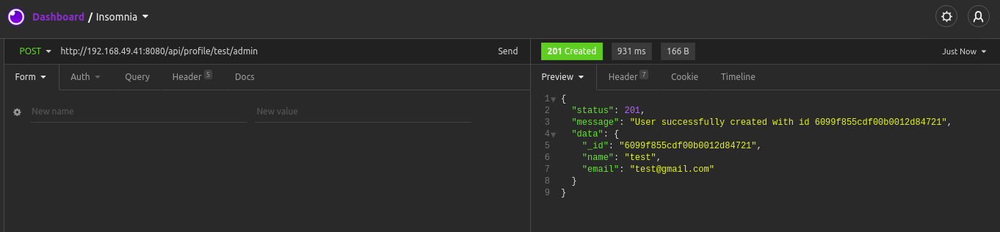

* ##### Show all users list

    * Access URL : /api/profile/users
    * Method     : GET
    * Additional : Token of user is needed when execute this endpoint, only admin types are allowed
    * Example success response :
    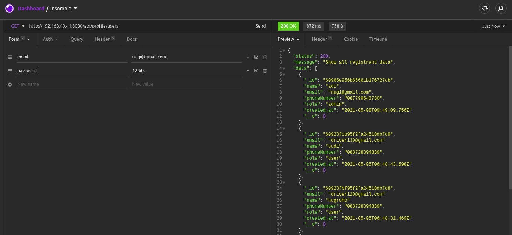
    * Example failed response, cause not admin who execute it :
    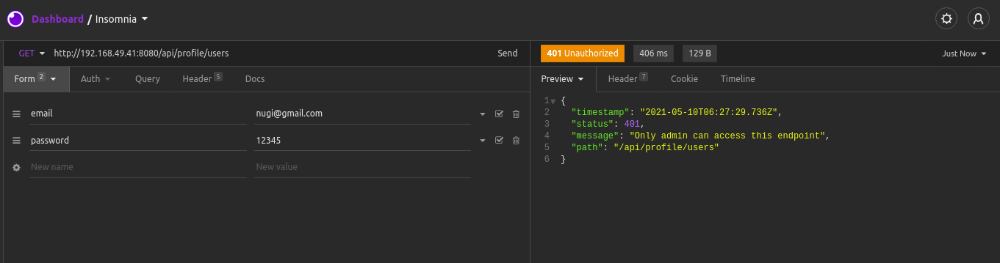
    * Example failed response, cause without token :
    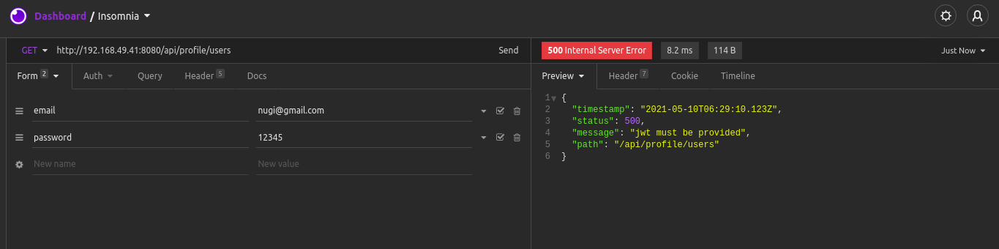

* ##### Show one specific user

    * Access URL : /api/profile/user/:id
    * Method     : GET
    * Additional : Token of user is needed when execute this endpoint, all of type users are allowed
    * Example success response :
    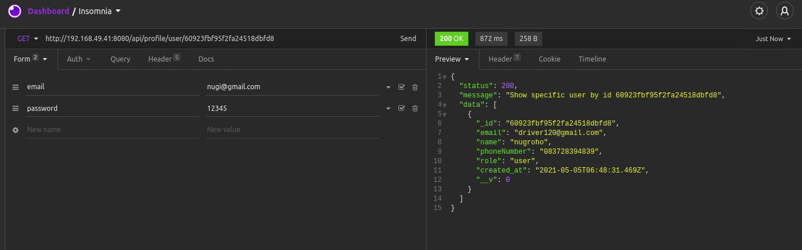
    * Example failed response, cause wthout token :
    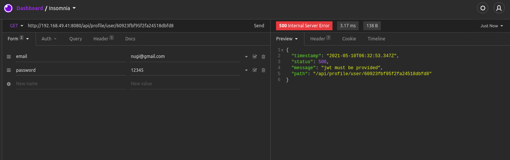

* ##### Create one user

    * Access URL : /api/profile/add/user
    * Method     : POST
    * Additional : Token of user is needed when execute this endpoint, only admin types are allowed
    * Parameters :
        | Name        | Type     | Description       |
        | ---         | -----    | ----              |
        | name        | string   | Name of user     |
        | email       | string   | Email of user     |
        | password    | string   | Password of user  |
        | phoneNumber | integer   | Phone number of user, only integer type are allowed     |
        | role        | string   | Role of user, only 'admin' or 'user'  |

    * Example success response :
    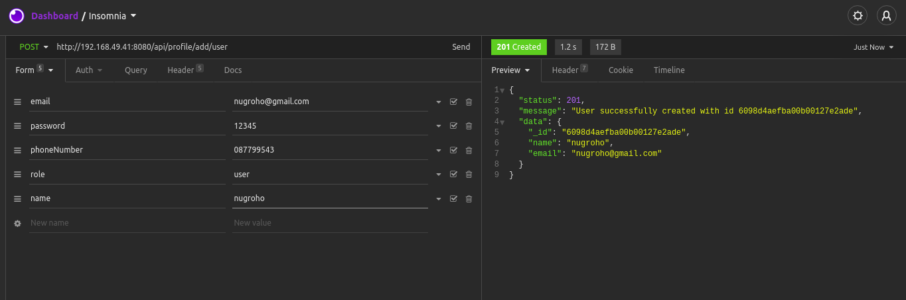
    * Example failed response, cause not admin who execute it :
    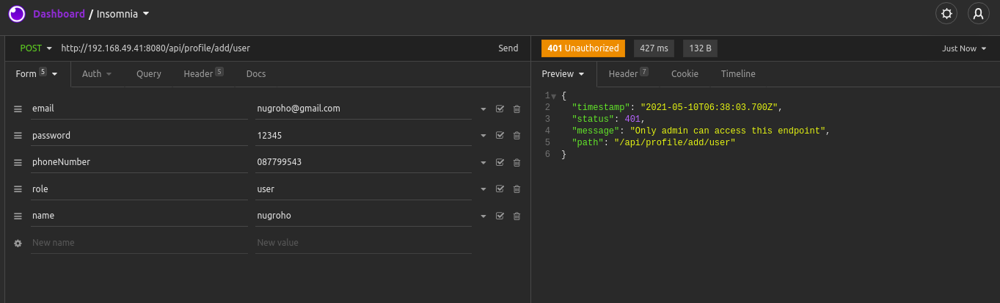
    * Example failed response, cause without token :
    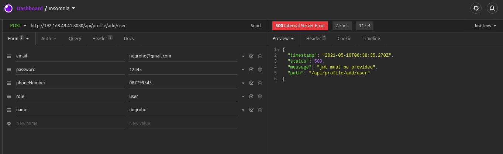

* ##### Modify one user

    * Access URL : /api/profile/modify/user/:id
    * Method     : PUT
    * Additional : Token of user is needed when execute this endpoint, only admin types are allowed
    * Parameters :
        | Name        | Type     | Description       |
        | ---         | -----    | ----              |
        | name        | string   | Optionally, Name of user     |
        | email       | string   | Optionally, Email of user     |
        | phoneNumber | integer  | Optionally, Phone number of user |
        | role        | string   | Optionally, Role of user  |

    * Example success response :
    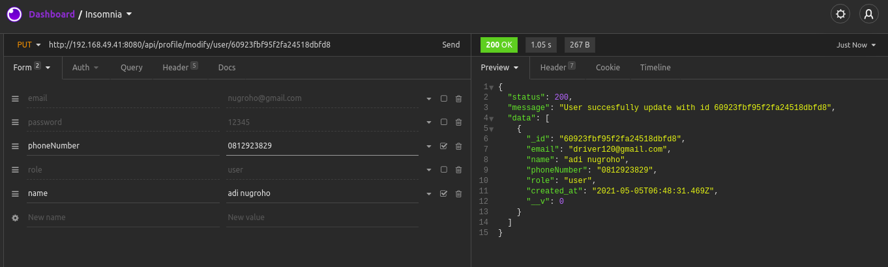
    * Example failed response, cause not admin who execute it :
    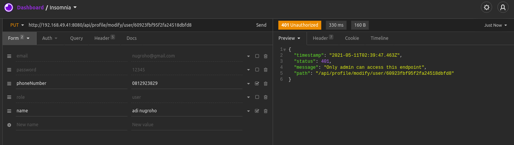
    * Example failed response, cause without token :
    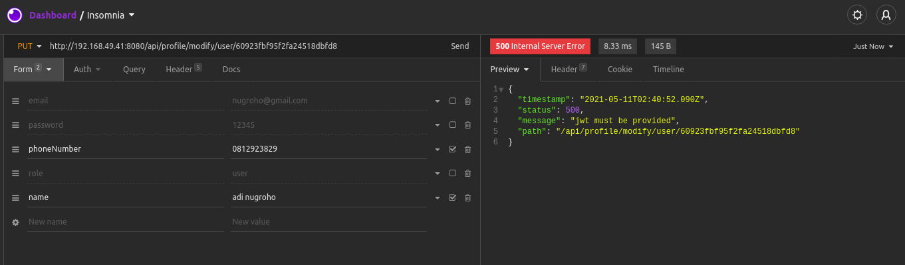

* ##### Delete one user

    * Access URL : /api/profile/delete/user/:id
    * Method     : DELETE
    * Additional : Token of user is needed when execute this endpoint, only admin types are allowed
    * Example success response :
    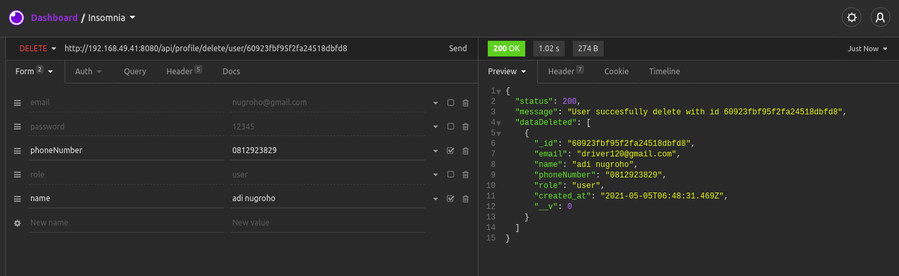
    * Example failed response, cause not admin who execute it :
    
    * Example failed response, cause without token :
    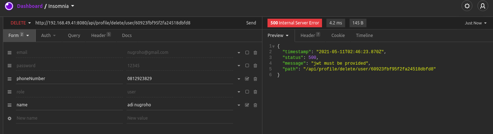